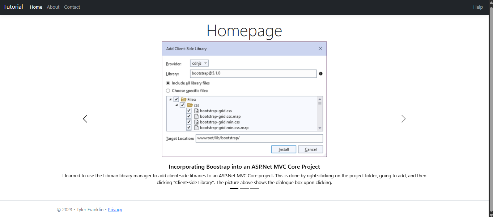
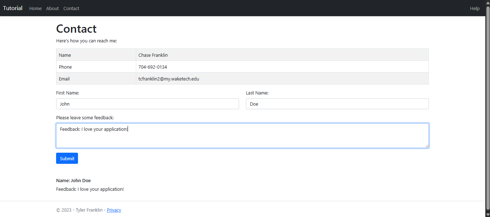
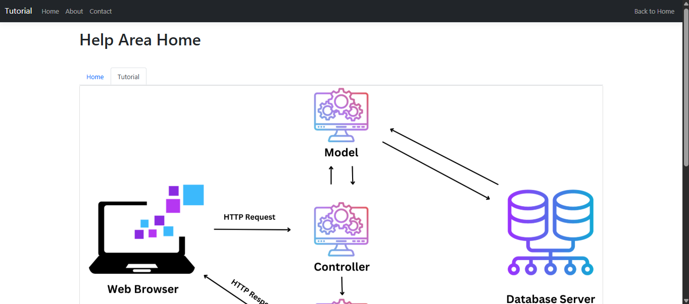

# ASP.NET Core MVC Tutorial App

## Overview
A learning project that demonstrates building, validating, and deploying an ASP.NET Core MVC web application using full CRUD functionality and Razor view templates. Deployed via Microsoft Azure App Service.

## Live Demo
[https://chasefranklinaspcoremvctutorial.azurewebsites.net](https://chasefranklinaspcoremvctutorial.azurewebsites.net)

## Technologies Used
- ASP.NET Core MVC (.NET 6+)
- C# / Razor Pages
- Entity Framework Core
- Bootstrap 4/5 for styling
- Microsoft Azure App Service (deployment)

## Features
- Full **CRUD functionality** for managing items
- **Razor views** for dynamic page rendering
- **Form validation** using Data Annotations
- **Model binding** and routing via controllers
- Responsive layout using **Bootstrap**
- Deployment pipeline to **Azure App Service**

## Screenshots

### Home / Index Page


### CRUD Form


### Detail View


## Getting Started

To run the project locally:

```bash
git clone https://github.com/yourusername/aspnetcore-mvc-tutorial.git
cd aspnetcore-mvc-tutorial
dotnet restore
dotnet run
Then go to https://localhost:5001 in your browser.
